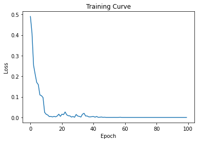

# CSC413 - Final Project
This project is a final submission for the University of Toronto course, CSC413: Neural Networks and Deep Learning.

## The Model: Introduction

### Task Overview

Fake news is widespread and harmful, as it misleads people and is often used for revenue. Because of this our model's task is to take a social media post (such as a tweet), which is represented by a sequence of English words and emojis, and then the model performs binary classification to determine whether the post is presenting real or fake information related to COVID-19.

### Model Overview

The model we build is a Transformer Encoder, which takes as input a sequence of words, converted to indexes using GloVe's string to index function (for memory efficiency). This input is then passed through a GloVe Embedding layer, a fixed Positional Encoding layer, and into a sequence of multi-head attention and feed forward layers. After passing it through these layers, we get a representation of each of the words in the sequence, so we take the mean representation across the words and then pass it through a final fully-connected layer with an output width of 2, denoting the 2 classes of "real information" or "fake information". This vector of 2 classes is then converted to probabilities using the softmax function, and the prediction is finally made by choosing the class corresponding to the maximum probability. This can be compared to the grouth truth value of 0, representing fake information, or 1, representing real information, to generate the loss signal. 

## Model Figure and Steps Involved in Computing the Forward Pass

### (1) Input Embeddings 

First we will look at the input embedding layer. We take in an social media post in the form of a list of words and pre-process it by assigning each word its unique index, using GloVe's string to index function. Once we have our list of indexes, we will pass this through our input embedding layer, which uses pretrained GloVe Embeddings to transform the integers into a vector representation.

### (2) Positional Encodings

We then have a fixed positional encoding layer, which is used to assign positions to each word in the sentence. This is done by putting the odd indexes, of the previous layer's embeddings, in a cosine function and the even indexes in a sine function. Then this is added to the embeddings from the previous layer.

### (3) Multi-Head Attention 

Next, we have multi-head attention. In this layer of the model, from the embedded input from the previous layer, we learn matrices of queries, keys, and values so that we can determine which set of keys compares strongly to the set of queries. This is done by using the scaled dot product attention of each word in the embedded representation of the sequence. The larger this dot product attention, the more compatible the queries and keys are for our sequence of words. The dot products for each word are placed into vector and then normalized by scaling them by dividng by the square root of the key dimension, and then applying softmax. This is done to ensure they are all non-negative and sum to 1. This final attention output for all the embedded words in the sequence will then give us a matrix where each row is an updated representation for the word given by that row index. Since in our model we chose 5-attention heads, this attention procedure is performed 5 times separpately with each query/key/value matrix now having size (embedding dimension, embedding dimension / 5), where the embedding dimension is 300 in our case. This helps with attending to different parts of the sequence, while keeping the computational cost relatively the same as in one head. The resulting matrices from each head are concatenated, and then projected back to have the original size embedding dimension, using a final linear layer. 

### (3 and 4) Add & Norm and Feed Forward 

After the multi-head attention sub-layer, the output is added to the input before the multi-head attentional sub-layer and then this sum normalized to have 0 mean and variance 1, so as to reduce the effect of the gradient on the softmax function within the attentional and final layers being too small for extreme values. Then that output is passed to a feed-forward network consisting of two fully connected layers, with dropout and relu activation between them. Then once again the output of this feed-forward layer is added to the input right before it, and then this sum is normalized to have 0 mean and variance 1. Note the layers in 3 and 4 of the diagram considered as a whole form one encoder layer. Since in our model we chose to have 2 of these encoder layers, we have 2 of these encoder layers stacked on top of each other. This gives us a fixed length represtation for each word in the sequence.

### (5 and 6) Linear and Softmax 

The mean of the final output representation given by the previous encoder layers is then computed, with the mean being taken in the dimension of the words, and then this mean is passed to a linear layer of output size 2, to get the raw scores for binary classification.

## Model Parameters
For our parameter calculations, we first list some of our hyperparameters for the model. Our embedding size is 300, the attentional sublayers have 5 heads, the feed-forward network has a dimension of 2048, and there are 2 Transformer encoder layers. The GloVe embedding layer is from a pretrained pytorch module and we chose not to further train its parameters, as our dataset was not too large, thus there are no tunable parameters from the embedding layer to consider. The positional encoder layer is based on a fixed encoding scheme, thus also requiring no tunable parameters to consider. 

The Transformer encoder layer contains an multi-head attentional sub-layer, which has 5 heads, each with its own key, query, and value weight matrices, of size 300 x (300 \ 5) each, and with each having a bias of size 300. Note this value of 300 comes from the embedding size for each word that we chose as a hyperparameter and the 5 comes from the 5 heads we also chose as a hyperparameter. Thus the total parameters for this attention sub-layer is 5 * (3 * (300 * (300 \ 5) + 300)) = 274,500. The concatenation of the 5 heads is then put through a linear projection layer which has weight matrix of size 300 x 300 and 300 biases. This gives us overall gives 300 * 300 + 300 = 90,300 additional parameters. The norm layer after this layer has a weight vector of size 300, as well as a bias vector of 300. This once gives us overall 300 + 300 = 600 additional parameters. The feed-forward sublayer consists of two fully connected layers, the first with a weight matrix of size 300 x 2048 and 2048 biases, and the second with a weight matrix with 2048 x 300 weights and 300 biases. This gives us overall gives 2 * (300 * 2048) + 300 + 2048 = 1,231,148 additional parameters. The norm layer after this layer has a weight vector of size 300, as well as a bias vector of 300. This once gives us overall 300 + 300 = 600 additional parameters. So overall for one encoder layer we have 274,500 + 90,300  + 600 + 1,231,148 + 600 = 1,597,148 parameters. Since we are stacking 2 of these encoder layers, we have 2 * 1,597,148 = 3,194,296 parameters in total for both layers. Finally in the end since we mean of the representations of each word in the representation after the encoder layers, to get a vector of dimension 300, and use a fully connected linear layer of output width 2, it has a weight of size 300 x 2 and 2 biases. This gives us overall 300 * 2 + 2 = 602 additional parameters. 

Thus altogether our final model has 3,194,296 + 602 = 3,194,898 parameters.

## Model Prediction Examples

From the "Final Model Predictions and Performance Metrics" section found in the CovidTransformer.ipynb notebook, we see that post #1 in the test set: "Our daily update is published. States reported 734k tests 39k new cases and 532 deaths. Current hospitalizations fell below 30k for the first time since June 22. https://t.co/wzSYMe0Sht" has label real, and our model correctly classified it.

Also from the same section, we see that post #11 in the test set: "Two interesting correlations:

1) Children tend to weather COVID-19 pretty well; they also get a ton of Vitamin D.

2) Black people are getting slammed by COVID-19; black people also have much higher instances of Vitamin D deficiency (76% vs 40% in the general population)." has label fake, but our model incorrectly classified it as real.

## The Data

### Data Source

We used data gathered by [Patwa et. al (2021)](https://arxiv.org/ftp/arxiv/papers/2011/2011.03327.pdf) in an effort to "fight an infodemic". The data files are from a different machine learning model uploaded on a [GitHub repo](https://github.com/diptamath/covid_fake_news) with the same task, which uses the MIT license and specifies that we are allowed to use a copy of the software without restriction, free of charge.

## Data Summary

The dataset consists of around 10,700 posts labeled real or fake depending on the information contained. We have ensured that each of the train, validation, and test sets contain a near equal number of each class (fake and real) to prevent the possibility of training, validateing and testing with biased data.

The average length of each post is 27.6 words and 137 characters, which is reasonable because the max length of a tweet is 280 characters, and because our dataset is primarily composed of tweets, this ensures that our posts are not too short and not too long overall. The training data contains 19,395 unique words, with 5,141 of them appearing in both real and fake posts. The 10 most common words (note that we will talk about punctuation as words in the next section) with their _percentage_ frequencies are ('.', 7.03), ('the', 3.49), ('of', 2.24), ('https://t', 2.18), ('to', 2.07), ('in', 1.94), ('a', 1.57), ('and', 1.41), ('is', 1.07), ('for', 0.92). We have 19,395 unique words in the training dataset, with a total of 154,867 words. This means that the total number of words examples is 8 times larger than the number of different words. Overall this ensures that many words don't just appear a very small amount of times throughout the data set, which is important because if many words did appear only a small amount of times, it would be very difficult for the model to pick up on trends invoving the same word in different posts. Similar statistics are also found in the validation and test data sets, as can be observed in the explore_data.ipynb notebook. Given this and the fact that we have a total of over 10,000 labeled data points, we can conclude that we have enough data.

## Data Transformation

The data was transformed by opening each of the training, valiation, and test datasets as a csvfiles, and reading each row as a string. The post (second column of each row) was split into a list of strings for each word, and the label (third column of the row) was converted to an integer (1 for 'real', 0 for 'fake'). Using the GloVe's string to index function, all posts' words were transformed into the corresponding word index in GloVe, and words with no GloVe index were removed. Then these translated posts and their corresponding labels were put into lists corresponding to the dataset they were from (training, validation, or test set) and the posts were padded with 0s on their right sides to account for variable input length, per the max length of each dataset. Note we accounted for this padding later on in our model by masking the 0s in our Transformer model, so that our model ignores them.

During the splitting of sentence strings into lists of word strings, punctuation was separated and counted as words. This was done because official statements in posts, a.k.a. real news, are generally well-written, while it is common to find posts with fake news to have poor punctuation or exaggeration, such as multiple exclamation marks. Thus, we felt the need to keep punctuation in the posts as they may contribute to the prediction of whether the information is real or fake.

According to [Patwa et. al (2021)](https://arxiv.org/ftp/arxiv/papers/2011/2011.03327.pdf), most of the dataset consisted of tweets, but some datapoints were from other social media platforms. In our model, we padded inputs to have same length, so that we can take advantange of vectorization using tensors, to improve our training runtime and efficiency and so that we can batch more easily and accurately. Due to this we decided to remove posts that were longer than 280 characters (where 280 is the max size of a tweet), so that we did not have to deal with very large tensors, just due to a very large posts. Removing posts longer than 280 characters resulted in removing 816 posts from the training data, leaving us with 5,604 datapoints to train on. Given the significant decrease in training time, we determined that the trade-off from losing these datapoints was worth it.

From the "Extracting/Processing Data" section found in the CovidTransformer.ipynb notebook, the data transformation code can be seen.

## Data Split

The data we obtained from the source was already pre-split into the standard 60% for training, 20% for validation, and 20% for test. Even after processing the data and further removing some posts from the datasets, we still have this distribution of the dataset. We kept this pre-split because the authors that gathered the data have found this split to work well on various different ML models, such as logistic regression and support vector machine, and because we also found that we obtain great training and validation results with this split. 

## Training Curves for the Final Model

## Hyper Parameter Tuning

Tuning was the lengthy part of this project. We followed the tips in the debugging tutorial slides and generalization lecture slides. To begin with, we started off with a learning rate of 0.001, batch size of 32, embedding size of 50, and 7 epochs. Very quickly on we found that very small batch sizes, such as sizes less than 100, work very poorly and resulted in severe underfitting. We also found that many epochs were needed by the model, as it continued to converge even after 20 epochs. After some more experimentation with the other hyperparameters of the model, such as the dropout values, we decided on the number of encoder layers to be 2, the dropout values to be 0.1, the dimension of the feed forward layer to be 2048, and the number of heads to be 5. This was chosen by slightly tweaking the default values provided by the pytorch module and seeing that they performed well on the validation set. Finally as seen in the Hyperparameter Tuning part of the CovidTransformer.ipynb notebook, we tested the performance of a couple of sets of hyperparameters, that all performed very well on both the training set and validation set during our initial testing. We ran each for 50 epochs, and from here we settled on choosing the embedding size to be 300, batch_size of 512, and the learning rate of 2e-4, as it gave us very high training and validation accuracies and the final training curves seemed to converge relatively stably in the end. Also we used the idea of early stopping and used the checkpoint at epoch 56 for this model because it gave the highest validation accuracy, such that the validation accuracies afterwards started dropping slightly. Our final model's weights can be downloaded through the link https://drive.google.com/file/d/1i5p1UOGjkqghIzWYT5DKxgjK1zq2f4LW/view?usp=sharing. Note we did not include it in our repo, since it was very large.

## Quantitative Measures

For our model and data, calculating the classification accuracy is a reliable and reasonable quantitative measure for our binary classification task, because we have an approximately equal number of data samples belonging to each class, fake and real, in all three of the datasets: training, validation, and test. 

We are also measuring True Positive Rate (TPR) and True Negative Rate (TNR) as well as Positive Predictive Value (PPV) and Negative Predictive Value (NPV). Once again since we have a near equal split of fake and real classified data, these TPR, TNR, PPV, and NPV values will also help show whether our model is robust. 

## Quantitative Results 

After tuning the hyperparameters, our model was able to obtain a training accuracy of ~99.9%, a validation accuracy of ~92.4%, and a test accuracy of 91.3%. Using our test set, our values for true positive rate (TPR) ended off being 91.70% and true negative rate (TNR) being 90.89%, meanwhile we also had that our positive predictive value (PPV) was 90.60% and our negative predictive value (NPV) was 91.97% (results found in CovidTransformer.ipynb notebook under "Final Model Predictions and Performance Metrics"). A very simple baseline model was implemented to compare to. The baseline model creates a dictionary of all the words that appear in the training set and counts the number of times the word appears in fake and real posts. After, the probability of each word being in a real or fake sentence can be determined based on the training data. To predict, the average probablility of all the words in the sentence being real (or fake) is calculated, and the one with higher prbabililty is the prediction. The baseline model had a training accuracy of 81%, while the test accuracy was 51% (code found in the baseline.ipynb notebook) (Note that for the base model, there are no hyperparameters to tune and so the validation set was absorbed into the training set).

## Qualitative Results

In terms of non-numerical data, we have noticed that our model was a very good predictor when it came to multiple question marks in a row. As seen in the table above, the model correctly predicted that the posts provided, which have many question marks in a row, were indeed fake each time. 

Though on the contrary, as seen in the table above, our model was not a good predictor when it came to having URLs in the posts. 

Note the results in the table we presented are just a few of what we observed. All the printed results that we observed can be found printed in CovidTransformer.ipynb notebook under "Final Model Predictions and Performance Metrics".

## Justification of Results

Note our baseline model mentioned in quantitative results shows the difficulty of the problem, because even after doing the training in the baseline model, the test accuracy was still only 51%, which is hardly any better than flipping a coin, as we are dealing with binary classification. Let's consider our final model now. Now due to this problem difficulty, we knew it was necessary to use the more powerful Transformer model, because of how well it captures sequential data, such as text in our case. More specifically we only used a Transformer Encoder model, as we only required a rich representation of the input posts, and we did not need to decode it back into any sequences. Given the power of Transformer models, our model having a a training accuracy of 99.9%, a validation accuracy of 92.4%, and a test accuracy of 91.3% this great performance was actually expected. Hence we clearly see that using a Transformer model, the model was able to make more accurate predictions, since it was able to take the whole sentence into consideration as a whole sequence. 

Looking back at the TPR and TNR being 91.70% and 90.89% respectively, we can further conclude that the model is robust because in our evenly split data, we predicted a large number of "real" posts correctly and a large number of "fake" posts correctly. This is also backed up by the PPV and the NPV being at 90.60% and 91.97% respectively. Hence, the qualitative results show us that our model is robust and can correctly predict if the social media posts present "real" or "fake" information related to COVID-19. When it comes to how robust our model is.

As for our model performing relatively bad for posts that have URLs, which we observed in the qualitative results above, this was actually an oversight in how we were pre-processing our inputs. We removed words from our data that did not have a GloVe Embedding. As a consequence, this which resulted in these URLs to be removed, and the posts are instead left with by many ellipses in a row. Since there are many URLs in datapoints in our dataset, this definitely limited our model in terms of having less information to infer on, thus the relatively bad performance in this case is expected. For the future, we would instead either train our own Embedding layer, so that it can include these URLs, or we would look into how to update the GloVe embedding, so that it can incorporate these URLs. 

## Ethical Considerations

The benefits of our model are immense, as by classifying whether a post about COVID-19 presents real or fake information, people that are using social media can be filtered from viewing information that presents fake information about COVID-19. This overall can protect people from making incorrectly informed decisions about factors which may affect their health and the public health, such as deciding whether to wear a mask or deciding whether to protest against lockdown measures. With that being said our model and training data may have some sources of limitations, such as the data being used may be biased and the actual output of our model being binary may not be a good representation to determine whether a social media post should be filtered or not. Due to this, these details must be further thoroughly examined, or else it could have negative consequences. 

In terms of the actual data we obtained, the actual collectors of the data mentioned in their own paper (found on https://arxiv.org/ftp/arxiv/papers/2011/2011.03327.pdf) that fake posts were "manually verified with the original documents". The issue with this is that we do not know what these original documents are, and what scientific ideologies/practices were followed in determining whether some fact was fake. This is a problem even if the original documents claim something to be true, because even the medical community has many disagreements on what is true or false. For example within Ontario, doctors at the provicial and municipal level disagree on whether the mask mandate is safe to lift or not based on their ideologies. So verifying with one leading expert, for example say a doctor at the provicial level, may result in a social media post being classified as fake, compared to say a doctor at the municipal level potentially classifying it as true. Negative consequences of not looking into this issue further, in terms of social media filtering, include filtering out medical advice that could save lives, such as filtering out whether or not taking a COVID-19 vaccination is helpful in preventing death.

In terms of the model, its classification of social media posts presenting real or fake information about COVID-19 may be misleading in terms of filtering a post. For example if a tweet by a political figure presents some real information about COVID-19 (or even none at all), but this tweet is coupled with other text that may be unrelated to COVID-19, such that our model classifies the entire tweet as presenting fake information about COVID-19, the entire tweet by the political figure can be filtered. This can potentially filter out political figures from communicating on social media platforms, and with how big social media's reach is, this can have consequences such as influencing masses of voters to choose one political figure over another during elections. Because of this, how the model performs with social media posts that include topics that are not COVID-19 related must be thorougly looked into further. If it cannot handle multiple topics, this model should definitely not be used, and perhaps instead a better model would be one that identifies subsequences within posts that may have misinformation about COVID-19.

## Authors

This project is brought to you by Joshua Fratarcangeli, Nada El-Falou, Raghav Sharma, and Yash Dave. Overall, we "pair programmed" and worked synchronously on calls, switching around tasks and helping each other constantly. However, the general task split was as follows:
- Joshua: data loading and exploration, model write-up
- Nada: data pre-processing and exploration, model training, write-up
- Raghav: Transformer model design and implementation, code debugging, write-up
- Yash: model training, write-up
